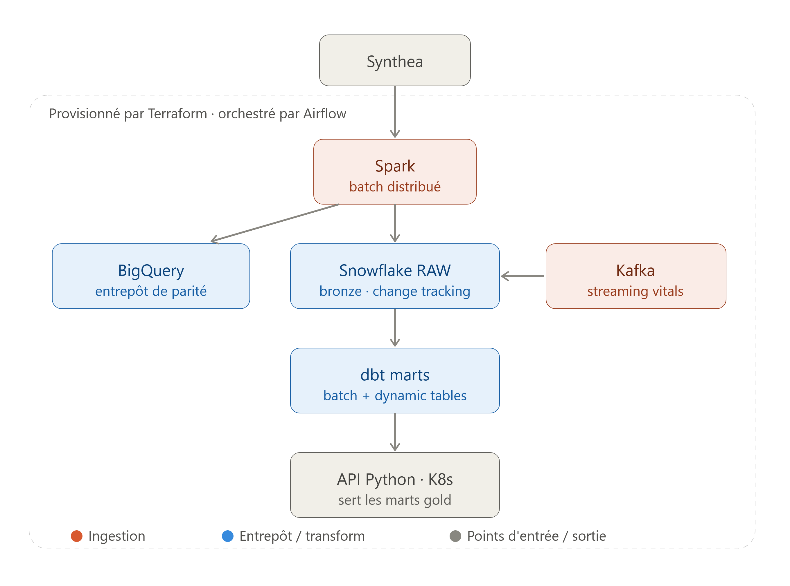

# 🏥 health-data-platform

> Modern healthcare data teams juggle batch ETL, near-real-time refresh and streaming ingestion — often as disconnected demos on disconnected stacks. This project builds them as **one connected platform, not eight parallel silos**, and **treats infrastructure and orchestration as first-class citizens** rather than afterthoughts.

An end-to-end healthcare data platform demonstrating a coherent progression from **batch → near-real-time → streaming**, on a single shared dataset, framed for a **Data Engineering role in the healthcare sector**.

Its defining feature is the **connective tissue**: every ingestion path (Spark batch, Kafka streaming) lands in the *same* Snowflake `RAW` layer, and the *same* dbt transformation models target Snowflake **and** BigQuery in parallel — proving cross-engine portability rather than warehouse lock-in. Terraform provisions the substrate; Airflow orchestrates across phases.


<p align="center">
  
</p>

## 🎯 Overview

health-data-platform simulates a production data platform for the healthcare sector on synthetic patient records — realistic, GDPR-safe, and complex enough (patients, encounters, observations, medications, organizations…) to justify every layer of the stack.

The dataset is **Synthea** (MITRE open-source synthetic EHR data), and it is the *only* source. Every phase reuses it, so the platform tells **one story instead of eight demos**:

- **Batch:** Synthea → Spark → shared `RAW` → dbt marts → Python API
- **Near-real-time:** Snowflake Streams capture deltas on `RAW`; Dynamic Tables refresh the marts declaratively
- **Streaming:** Kafka streams simulated vital signs into the *same* `RAW`
- **Parity, not flow:** Snowflake and BigQuery run the *same* dbt models — cross-engine portability, not migration
- **Provisioned & orchestrated:** Terraform stands the platform up, Airflow drives it

## 🔗 The connected-platform design

The point isn't "I built eight things"; the point is that they compose. Three architectural choices make the platform coherent:

- 🧷 **A shared `RAW` layer as the single point of integration.** Every ingestion path — batch (Spark) and streaming (Kafka) — writes to the same Snowflake `RAW` schema. Every downstream layer (near-real-time via Streams + Dynamic Tables, batch marts via dbt) reads from it. One seam, one contract, one source of truth.
- 🧰 **Terraform and Airflow as the connective tissue.** Terraform provisions the shared substrate (Snowflake databases, BigQuery datasets, K8s namespaces) so every phase deploys against the same infrastructure. Airflow builds end-to-end DAGs that span *ingestion → transformation → serving*, turning phase folders into pipeline stages instead of leaving them as standalone demos.
- 🔀 **Snowflake and BigQuery as parallel parity targets — never a flow.** The same dbt models run on both engines. This proves **portability** (`{{ dbt.datediff() }}`, quoted identifiers, `float` vs `double` handled at the transformation layer), not migration. It also makes the eventual re-platforming argument credible: the transformation layer is engine-agnostic *by design*.

The design decision I'm most proud of: **the shared `RAW` schema is the seam of integration**. Everything ingests into it, everything transforms from it. That one contract is what turns four folders of demos into one platform. Without it, batch/NRT/streaming would each end up owning a private version of the truth — the exact anti-pattern this project exists to refute.

## ✨ Features

**Delivered (parts 1a, 2a):**

- 📊 **14 analytical dbt models** running on DuckDB (local dev / CI mirror) and Snowflake (cloud production)
- ✅ **59 dbt tests passing** in `ANALYTICS_PROD`
- 🔒 **Least-privilege Snowflake setup**: `SVC_LOADER` (role `LOADER`) writes `RAW`, `SVC_DBT` (role `TRANSFORMER`) transforms — clean separation
- 🔑 **RSA key-pair authentication** for all service accounts (Snowflake blocks single-factor password auth since Nov 2025)
- ♻️ **Idempotent `setup.sql`** — safe to re-run from the top after fixing any single failure
- 📥 **Reproducible Synthea ingestion** via Snowflake CLI (`PUT` → `INFER_SCHEMA` → `COPY INTO`)
- 🏭 **Scheduled `Daily build`** job on dbt Platform, targeting `ANALYTICS_PROD`

**Planned:**

- ⚡ **Snowflake Dynamic Tables + Streams** for near-real-time marts (part 2b, in progress)
- 🌍 **Terraform provisioning** of Snowflake, BigQuery and Kubernetes (part `infra/`)
- 🌊 **Spark distributed batch ingestion** superseding the CLI load (part `ingestion/`)
- 🔀 **Cross-engine parity** — the same dbt models on Snowflake *and* BigQuery (parts 1b + `health_dwh_bq`)
- 📡 **Kafka streaming** of vital signs into the shared `RAW` (part 3)
- 🎼 **Airflow DAGs** orchestrating dbt builds and the Kafka→Snowflake pipeline (part 4b)
- 🖥️ **Python API on Kubernetes** serving the gold marts (part 4a — capstone)

## 🏗️ Architecture

Full diagram: [`docs/architecture.png`](docs/architecture.png). Text version:

```
Synthea
   │
   ▼
Spark (distributed batch) ────┐
   │                          │
   ▼                          ▼
Snowflake RAW  ◄──── Kafka    BigQuery (parity)
   │  (bronze · change tracking)
   ▼
dbt marts (batch + Dynamic Tables)
   │
   ▼
Python API on Kubernetes  (serves gold marts)

▲ Provisioned by Terraform · orchestrated by Airflow ▲
```

- **Backbone** — `Synthea → Spark → RAW → dbt marts → API`
- **Near-real-time overlay** — Kafka writes vitals to the same `RAW`; Streams capture the delta; Dynamic Tables refresh the marts declaratively with a bounded `target_lag`
- **Parity target** — BigQuery datasets fed by the same dbt models. Same logic, different engine.

## 🛠️ Tech stack

| Layer | Tool | Why this choice |
|---|---|---|
| IaC | **Terraform** (Snowflake, BigQuery, Kubernetes providers) | Declarative and reproducible — the same code recreates the entire platform on a fresh account, which is the whole point when the account is a 30-day trial |
| Batch ingestion | **Apache Spark** | Distributed compute; the credible answer when someone asks "and if the CSVs were 100× bigger?" |
| Streaming ingestion | **Apache Kafka** | Durable, replayable event streams — the default choice for vitals-like data |
| Warehouse (primary) | **Snowflake** (AWS `eu-west-3`) | Streams + Dynamic Tables give warehouse-native near-real-time without spinning up a separate compute layer |
| Warehouse (parity) | **BigQuery** | Second engine to prove the transformation layer is engine-agnostic |
| Transformation | **dbt** (Platform for managed Snowflake runs, `dbt-core` in Airflow) | Standard for SQL transformation, testing and lineage; the layer where portability actually lives |
| Orchestration | **Apache Airflow** | End-to-end DAGs spanning ingestion → transformation → serving; the replacement for isolated phase demos |
| Serving | **Python + FastAPI on Kubernetes** (local) | Production-shaped API layer with scaling, health checks, redeploys |
| Local dev / CI | **DuckDB** | Free gate before spending Snowflake credits — same dbt models, zero cloud cost |
| Auth | **RSA key-pair** | Mandatory on Snowflake since Nov 2025; password auth is blocked |
| Python | **`uv`** | Fast, modern, reproducible — replaces `pip` + `venv` + `pip-tools` in one tool |
| Dataset | **Synthea** (MITRE) | Realistic synthetic EHR data, zero privacy risk, domain-appropriate |

## 📊 Current status

The project is intentionally structured **foundation → glue → extensions**, so the platform is provably connected before new phases are bolted on.

### ✅ Delivered

| Part | What it delivers | Evidence |
|---|---|---|
| **1a — dbt on DuckDB** | 14 analytical models, tests, local dev mirror | Runs locally via `dbt build` |
| **2a — Snowflake DWH** | Idempotent `setup.sql`, Synthea loaded, dbt models ported, least-privilege roles, RSA auth, dbt Platform `Daily build` job | **59 dbt tests passing** in `ANALYTICS_PROD` |

### 🚧 In progress

**Part 2b — Snowflake Dynamic Tables + Streams.** Adding warehouse-native near-real-time on the existing `RAW`:

- convert `mart_organization_kpis` to `materialized='dynamic_table'` with `target_lag` / `snowflake_warehouse` config, side-by-side with the batch mart to make the batch ↔ near-real-time contrast explicit
- create a Stream on a `RAW` table (e.g. `encounters`), simulate new rows, consume the delta from an incremental dbt model
- extend `setup.sql` with the missing grants (`CREATE DYNAMIC TABLE`, `CREATE STREAM`, `CHANGE_TRACKING` on `RAW` tables)
- suspend the dynamic table after demo — short `target_lag` autonomously wakes the warehouse and violates zero-idle-cost

### 🗺️ Roadmap

1. **Finish 2b on the current trial account** with `setup.sql`. No Terraform retrofit here — this account stays the frozen 2a/2b demo.
2. **Write the Terraform Snowflake config** mirroring `setup.sql`, without applying it to the current account.
3. **`terraform apply` on a fresh trial account** (the one already planned for the Kafka phase) — IaC proven from scratch, no import/state pain.
4. **First Airflow DAG** orchestrating the dbt build on the Terraform-provisioned account. *This is the moment the platform stops being a collection of parts.*
5. **Spark ingestion** — distributed batch Synthea → shared `RAW`, superseding the current CLI load.
6. **Part 1b (cross-database refactor)** so the same dbt models run on DuckDB + Snowflake + BigQuery. Then **real BigQuery** via Terraform.
7. **Capstone — Part 4a:** Python API on Kubernetes serving the gold marts.

### 🎛️ Open architectural decisions

Deliberately deferred to the entry of each step, not locked in up front:

| Step | Decision | Options |
|---|---|---|
| Terraform bring-up | Where does infra truth live? | **Replace** `setup.sql` (single source of truth) **vs. complement** it (Terraform = infra/roles/grants, dbt `on-run-start` hooks = fine-grained grants) |
| Airflow bring-up | How does Airflow trigger dbt? | Call the **dbt Cloud job via API** (keep managed) **vs.** run **`dbt-core` directly** (drops managed in prod, more "data engineering") |
| Spark bring-up | How does Spark feed `RAW`? | **Alimente the shared `RAW`** (dbt sources repointed CSV → Parquet) **vs.** stay **parallel** to the current `PUT` → `INFER_SCHEMA` → `COPY INTO` path |

## 🧠 Engineering notes

A few real problems solved while building this, and what they taught me:

- **Snowflake scripting halts mid-script on error.** The first `setup.sql` was non-idempotent and left the account in half-configured states when a grant failed. Rewrote it to be safe to re-run from the top after fixing any single statement. **Lesson**: for infrastructure scripts, idempotency isn't a nice-to-have — it's the difference between a recoverable and an unrecoverable failure.
- **dbt Platform + Git branch management is a persistent friction point.** Editing files locally in WSL, pushing, then pulling in the dbt IDE produced sync issues that ate hours. Editing directly in the dbt Platform IDE for dbt-Platform-managed changes eliminated the class of problem. **Lesson**: use each tool at the level of abstraction it was designed for; fighting the intended workflow is usually a losing bet.
- **`dbt_project.yml` name must match the project.** A mismatch caused dbt Platform to silently execute the wrong project — an invisible failure mode. Renaming to `health_dwh` fixed it. **Lesson**: implicit conventions are landmines. When a system quietly does the wrong thing, the fix is usually one line in a config you weren't looking at.
- **Snowflake SQL porting from DuckDB was subtle.** Mixed-case identifiers need quoting (`"Id"`), reserved words need quoted uppercase (`"START"`, `"STOP"`), `double` becomes `float`, `date_diff()` becomes `{{ dbt.datediff() }}`. Discovered by test failures more than by documentation. **Lesson**: cross-database portability isn't free — it's the price of the 1b refactor, and one of the main reasons the parity target exists.
- **Single-factor password auth is blocked on Snowflake (Nov 2025).** RSA key-pair authentication is mandatory. Generating keys, provisioning them per service account, and mounting them into dbt Platform is now a permanent setup step. **Lesson**: SaaS security posture changes fast; anything relying on password auth has a countdown timer on it.
- **Source-data anomalies should be documented honestly.** Synthea produced a 35% "readmission rate" that turned out to be chronic scheduled follow-ups misclassified by a naive query — not a pipeline bug, but a data-modeling one. Documented in the model rather than silently filtered. **Lesson**: healthcare data has legitimate weirdness; the credible response is to name it, not to hide it.
- **DuckDB is unsupported on dbt Platform.** Discovered the moment I tried to point managed dbt at a DuckDB target. Forced the clean split between "1-duckdb/ = local + CI mirror" and "2-warehouse/ = managed cloud". **Lesson**: verify plugin/provider compatibility *before* committing to an architecture — a two-hour search saves a two-day pivot.
- **Zero-idle-cost is a discipline, not a checkbox.** Short `target_lag` on Dynamic Tables autonomously wakes the warehouse and burns credits silently. Warehouses auto-suspend, Dynamic Tables get suspended after demo, Airflow will be triggered on demand rather than run 24/7. **Lesson**: "the platform works" and "the platform is running" are different statements. Cost discipline turns portfolio projects into credible production designs.

## 📁 Project structure

```
health-data-platform/
├── infra/                      # Terraform — shared foundation (cross-cutting)
│   ├── snowflake/              #   databases, schemas, warehouses, roles, grants
│   ├── bigquery/               #   parity datasets
│   └── kubernetes/             #   namespaces, local cluster (part 4)
├── ingestion/                  # Spark — distributed batch Synthea → RAW
├── 1-duckdb/                   # 1a/1b — local dbt (dev / CI mirror)
├── 2-warehouse/                # 2a/2b — Snowflake (Dynamic Tables, Streams)
│   ├── health_dwh/             #   dbt project on Snowflake (existing)
│   └── health_dwh_bq/          #   same dbt models, BigQuery target (parity)
├── 3-kafka/                    # 3a/3b — streaming vitals → RAW → hybrid dbt
├── 4-serving/                  # 4a — Python API on Kubernetes
├── orchestration/              # 4b — Airflow: dbt build DAGs + Kafka→Snowflake
└── data/                       # Synthea (shared source)
```

The phase folders (`1-…` → `4-…`) tell the batch-to-streaming story; `infra/`, `ingestion/` and `orchestration/` are the transverse layers that turn those phases into a single platform.

## ⚙️ Environment

- **OS**: Windows + WSL2 Ubuntu
- **Containers**: Docker Desktop
- **Editor**: VS Code
- **Python**: managed exclusively with [`uv`](https://docs.astral.sh/uv/) — never `pip`, never `venv`
- **Cloud**: Snowflake on AWS `eu-west-3` (Paris), 30-day trial accounts (a binding constraint that shapes parts 2a / 2b / 3b)

## 📄 License

MIT — see the [LICENSE](LICENSE) file for details.
